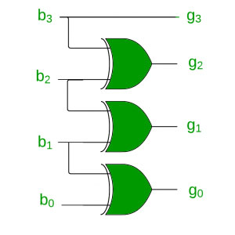

# Recursion I

## 递归
+ 递归函数是一种自我调用的函数

+ 阶乘  
    数学定义： 
    + 0！=1
    + N! = N(N-1)! if N > 0

+ 斐波那契
    + f(0) = 0, f(1) = 1
    + f(n) = f(n-1) + f(n-2), for n>1

 
## EX 1 求和

    def mysum_recursive(n):
        if n == 0:
            return 0
        return n + mysum_recursive(n-1)
    
## EX 2 阶乘

    
    #O（n）
    def factorial_recursive(n):
        if n == 0:
            return 1
        return n * factorial_recursive(n - 1)

## EX 3 斐波那契数列

    #O(n)
    def fibonacci1(n):
        assert(n>=0)
        a, b = 0, 1
        for i in range(1, n+1):
            a, b = b, a + b
        return a    

    #O(2^n)
    def fibonacci2(n):
        assert(n>=0)
        if (n <= 2): 
            return 1
        return fibonacci2(n-1) + fibonacci2(n-2)

    def fibonacci3(n):
        assert(n>=0)
        if (n <= 1): 
            return (n,0)
        (a, b) = fibonacci3(n-1)
        return (a+b, a)
    def fib3(n):
        assert(n>=0)
        if (n<=2):
            return 1
        (a,b) = fib3(n-1)
        return (a+b,a)

## Why Fibonacci? 
** 黄金比例：** 肚脐到脚的距离／身高＝0.618   

Fibonacci Square    

## EX 4 打印尺子
1

1 2 1

1 2 1 3 1 2 1

1 2 1 3 1 2 1 4 1 2 1 3 1 2 1

    #O(n)
    def ruler(n):
        assert(n>=0)
        if (n==1):
            return "1"
        t = ruler(n-1)
        return t + " " + str(n) + " " + t
    
    def ruler2(n):
        result = ""
        for i in range(1, n+1):
            result = result + str(i) + " " + result
        return result

运行ruler(3)： '1 2 1 3 1 2 1'    
ruler2(3)：'1 2 1 3 1 2 1 '

## 画尺子线：

    def draw_line(tick_length, tick_label=''):
        line = '-' * tick_length
        if tick_label:
            line += ' ' + tick_label
        print(line)

    def draw_interval(center_length):
        if center_length > 0:
            draw_interval(center_length - 1)
            draw_line(center_length)
            draw_interval(center_length - 1)
            
    def draw_rule(num_inches, major_length):
        draw_line(major_length, '0')
        for j in range(1, 1 + num_inches):
            draw_interval(major_length - 1)
            draw_line(major_length, str(j))

    draw_rule(1,5)

## EX 5 数学表达式

给定两个等于a≤b的整数，编写一个程序，以最小的增量（加1）和展开（乘2）运算序列将a转换为b。

例如，

23 =（（5 * 2 +1）* 2 +1）

113 =（（（（（11 +1）+1）+1）* 2 * 2 * 2 +1）

    def intseq(a,b):
        if (a == b):
            return str(a)
        if (b%2 == 1):
            return "(" + intseq(a,b-1) + "+1)"
        if (b < a*2):
            return "(" + intseq(a,b+1) + "+1)"
        return intseq(a,b/2) + "*2"

    a = 3;
    b = 101;
    print(str(b) + " = " + intSeq(a, b))

` 101 = ((3 * 2 * 2 * 2 + 1) * 2 * 2 + 1)`

## EX 6 汉诺塔
f(n) = 2^n - 1  

    def hanoi(n, start, end, by):
        if (n==1):
            print("Move from" + start + "to" + end)
        else:
            hanoi(n-1, start, by, end) 
            hanoi(1, start, end, by)
            hanoi(n-1, by, end, start)
    
    n=5
    hanoi(n, "start", "end", "by")

## <a id='Ex7'>Ex.7 格雷码  </a>

    def moves_ins(n, forward):
        if n == 0: 
            return
        moves_ins(n-1, True)
        print("enter ", n) if forward else print("exit  ", n)
        moves_ins(n-1, False)    
    
    moves_ins(3, True)

`enter  1`  
`enter  2`  
`exit   1`  
`enter  3`  
`enter  1`  
`exit   2`  
`exit   1`

## ** Why Grey Code? **

   

# Recursion II

## EX 1 找子集

给定一组不同的整数nums返回所有可能的子集

以[a,b,c]为例：  
[],     
加入a->[a]  
[],[a]  
加入b   
[],[a],[b],[a,b]    
加入c   
[],[a],[b],[a,b],[c],[a,c],[b,c],[a,b,c]    

    #用[：]来拷贝一个，否则会陷入死循环
    def subsets(nums):
        result = [[]]
        for num in nums:
            for element in result[:]:
                x=element[:]
                x.append(num)
                result.append(x)
        return result
    
    nums = ['a', 'b', 'c']
    print(subsets(nums))
`[[], ['a'], ['b'], ['a', 'b'], ['c'], ['a', 'c'], ['b', 'c'], ['a', 'b', 'c']]`

 **回溯**

因此，在使用递归解决问题时，我们将给定问题分解为较小的问题。 假设我们有一个问题，并将其分为三个较小的问题，并且。 现在的情况可能是，解决方案不依赖于所有三个子问题，实际上我们甚至都不知道它依赖哪个子问题。

让我们来看一个情况。 假设您站在三个隧道的前面，其中一个隧道的尽头有一袋金，但是您不知道哪个。 因此，您将尝试全部三个。 首先进入隧道（如果不是那个隧道），然后从隧道出来，进入隧道，然后再次进入隧道（如果不是那个隧道），从隧道出来进入隧道。 因此，基本上在回溯中，我们尝试解决一个子问题，如果未达到所需的解决方案，则 ** undo ** </ font>为解决该子问题所做的一切，然后尝试解决 另一个子问题。
    

